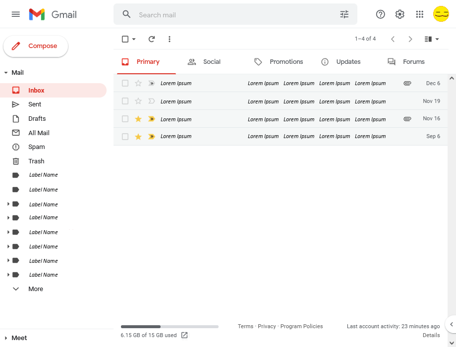
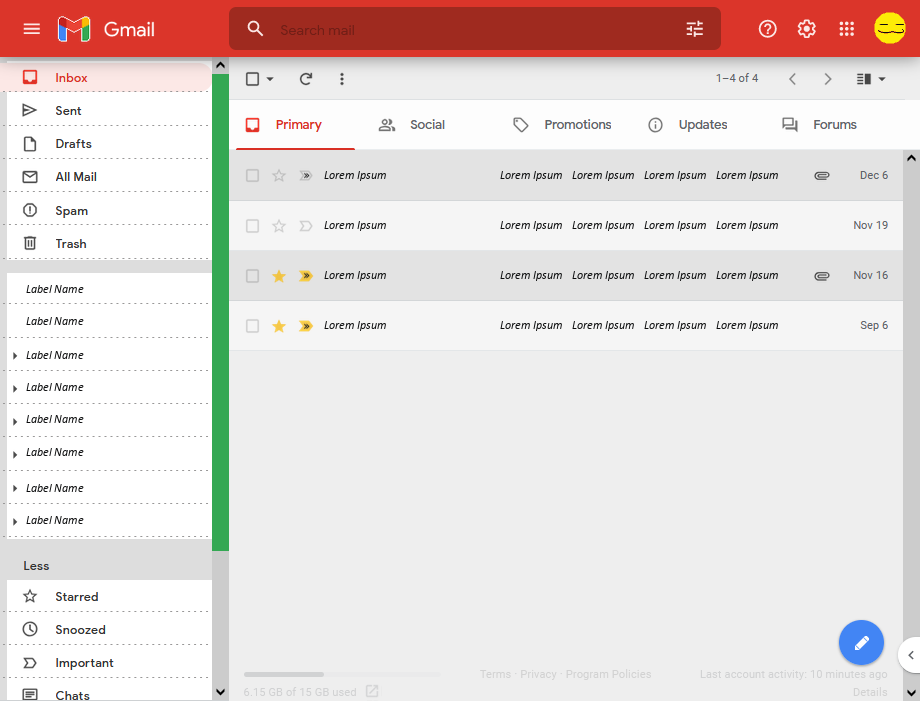

# Gmail, but more Fun!
 Small improvements to the Gmail UI, to make it more enjoyable to use, and consistent with other Google software.

This includes a Userstyle CSS file and a JS script to be used with TamperMonkey (or other similar addon).

Most notably, the script moves the Compose button into the lower right corner, which is more consistent with other Google software. All other changes are mostly cosmetic, to replicate more modern design, as well as some of the innovations made in Google's (canned) Inbox app.

## Screenshots

### Before:

### After:

## To Do:
In the future, I'd like to make a Dark version, and possibly more custom buttons (such as auto-searching with specific filters).

